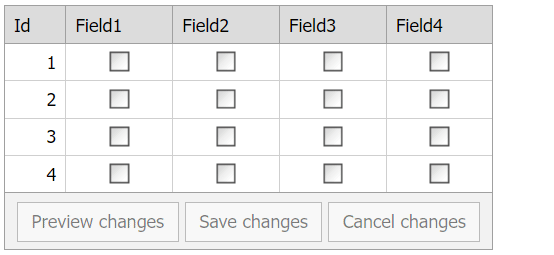
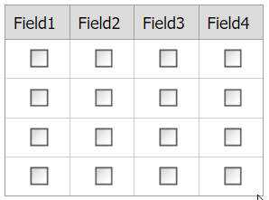

# Grid View for ASP.NET Web Forms - How to select a checkbox in a row when a data item template or batch edit mode is applied
<!-- run online -->
**[[Run Online]](https://codecentral.devexpress.com/t328305/)**
<!-- run online end -->

This example demonstrates how to configure the grid's cell edit functionality to select a single checkbox in a row.

## Batch Edit Mode



Handle the grid's server-side [CellEditorInitialize](https://docs.devexpress.com/AspNet/DevExpress.Web.ASPxGridView.CellEditorInitialize) event to initialize a checkbox editor and add the editor's client-side [CheckedChanged](https://docs.devexpress.com/AspNet/js-ASPxClientCheckBox.CheckedChanged) event handler. In that handler, use the grid's [batchEditApi.SetCellValue](https://docs.devexpress.com/AspNet/js-ASPxClientGridViewBatchEditApi.SetCellValue(visibleIndex-columnFieldNameOrId-value)) method to change a checkbox state. To indicate the updated cell, handle the grid's client-side [BatchEditStartEditing](https://docs.devexpress.com/AspNet/js-ASPxClientGridView.BatchEditStartEditing) event and use its [focusedColumn](https://docs.devexpress.com/AspNet/js-ASPxClientGridViewBatchEditStartEditingEventArgs.focusedColumn) and [visibleIndex](https://docs.devexpress.com/AspNet/js-ASPxClientGridViewBatchEditStartEditingEventArgs.visibleIndex) argument properties.

```js
var rowIndex;
var focusedColumn;

function checkedChanged(s, e) {
    for (var i = 0; i < grid.GetColumnsCount() ; i++) {
        var column = grid.GetColumn(i);
        var editor = grid.GetEditor(i);
        if (editor == null || column == focusedColumn || column.fieldName == "Id")
            continue;
        grid.batchEditApi.SetCellValue(rowIndex, column.fieldName, false);
    }
}

function onBatchEditStartEditing(s, e) {
    rowIndex = e.visibleIndex;
    focusedColumn = e.focusedColumn;
}
```

```aspx
<dx:ASPxGridView ID="ASPxGridView1" runat="server" ClientInstanceName="grid" KeyFieldName="Id"
    OnCellEditorInitialize="ASPxGridView1_CellEditorInitialize">
    <ClientSideEvents BatchEditStartEditing="onBatchEditStartEditing" />
    <SettingsEditing Mode="Batch" />
</dx:ASPxGridView>
```

```cs
protected void ASPxGridView1_CellEditorInitialize(object sender, DevExpress.Web.ASPxGridViewEditorEventArgs e) {
    if (e.Editor is ASPxCheckBox) {
        ASPxCheckBox editor = (ASPxCheckBox)e.Editor;
        editor.ClientSideEvents.CheckedChanged = "checkedChanged";
    }
}
```

## Data Item Template



Specify a column's [DataItemTemplate](https://docs.devexpress.com/AspNet/DevExpress.Web.GridViewDataColumn.DataItemTemplate) property and add a checkbox editor to the template. Handle the editor's server-side `Init` event and add a [CheckedChanged](https://docs.devexpress.com/AspNet/js-ASPxClientCheckBox.CheckedChanged) event handler. In the handler, get a checkbox state, send a callback to the server, and pass the checkbox state as a parameter. In the grid's server-side [CustomCallback](https://docs.devexpress.com/AspNet/DevExpress.Web.ASPxGridView.CustomCallback) event handler, check or uncheck checkboxes and save their states to the grid's data source.

```aspx
<dx:ASPxGridView ID="ASPxGridView1" runat="server" ClientInstanceName="grid" KeyFieldName = "Id"
    OnCustomCallback="ASPxGridView1_CustomCallback">
    <Columns>
        <dx:GridViewDataCheckColumn FieldName="Field1" VisibleIndex="1">
            <DataItemTemplate>
                <dx:ASPxCheckBox ID="cb" runat="server" Checked='<%# Eval("Field1") %>' OnInit="cb_Init" />
            </DataItemTemplate>
        </dx:GridViewDataCheckColumn>
        <!-- ... -->
    </Columns>
</dx:ASPxGridView>
```

```cs
protected void cb_Init(object sender, EventArgs e) {
    ASPxCheckBox checkBox = (ASPxCheckBox)sender;
    GridViewDataItemTemplateContainer container = (GridViewDataItemTemplateContainer)checkBox.NamingContainer;
    string key = string.Format("{0}|{1}", container.Column.FieldName, container.KeyValue);
    checkBox.ClientSideEvents.CheckedChanged = string.Format("function(s, e) {{ grid.PerformCallback('{0}|' + s.GetChecked()); }}", key);
}

protected void ASPxGridView1_CustomCallback(object sender, ASPxGridViewCustomCallbackEventArgs e) {
    string[] parameters = e.Parameters.Split(new char[] { '|' }, StringSplitOptions.RemoveEmptyEntries);
    string fieldName = parameters[0];
    string keyValue = parameters[1];
    bool isChecked = Convert.ToBoolean(parameters[2]);
    SampleDataRow rowWithResetFields = new SampleDataRow();
    rowWithResetFields.Id = Convert.ToInt32(keyValue);
    for (int i = 0; i < ASPxGridView1.Columns.Count; i++) {
        if (!isChecked || string.Equals(ASPxGridView1.DataColumns[i].FieldName, fieldName))
            SetFields(rowWithResetFields, ASPxGridView1.DataColumns[i].FieldName, isChecked);
        else
            SetFields(rowWithResetFields, ASPxGridView1.DataColumns[i].FieldName, !isChecked);
    }
    SampleDataRow findRow = ListSource.Find(r => r.Id == rowWithResetFields.Id) as SampleDataRow;
    // ...
    ASPxGridView1.DataBind();
}
```

## Files to Review

* [BatchEdit.aspx](./CS/BatchEdit.aspx) (VB: [BatchEdit.aspx](./VB/BatchEdit.aspx))
* [BatchEdit.aspx.cs](./CS/BatchEdit.aspx.cs) (VB: [BatchEdit.aspx.vb](./VB/BatchEdit.aspx.vb))
* [DataItemTemplate.aspx](./CS/DataItemTemplate.aspx) (VB: [DataItemTemplate.aspx](./VB/DataItemTemplate.aspx))
* [DataItemTemplate.aspx.cs](./CS/DataItemTemplate.aspx.cs) (VB: [DataItemTemplate.aspx.vb](./VB/DataItemTemplate.aspx.vb))

## Documentation

* [Grid in Batch Edit Mode](https://docs.devexpress.com/AspNet/16443/components/grid-view/concepts/edit-data/batch-edit-mode)
* [Grid View Templates](https://docs.devexpress.com/AspNet/3718/components/grid-view/concepts/templates)
